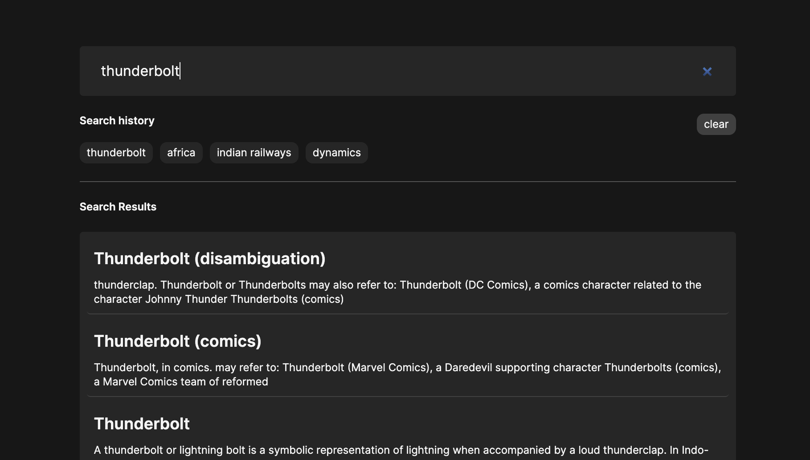

<div align="center">
    <h1 align="center">Wikipedia search and analysis tool</h1>
</div>



### services

To install the dependencies please follow the below steps

- ensure you have node installed

    ```sh-session
    node -v
    ```

### Environmental variables

`.env.local` has the `url` for wikipedia api that can be used to query the data

### Tools and technologies used

1) [Typescript]()

2) [NextJs](https://nextjs.org/) : Framework

3) [Graphql](https://graphql.org/): Query language

4) [Apollo Graphql](apollographql.com): Apollo Graphql for graphql client and server support

5) [Tailwind css](https://tailwindcss.com/): Tailwind css for styling and building minimal UI

### Why this stack?

We use `@apollo/server` and `@apollo/client` in `Nextjs` with `app-rounter` because 

`apollo graphql` helps us use the graphql both on server and client effectively.

`Nextjs` comes with support like :
1) Built in Built-in Optimizations
2) Automatic Image,
3) Font, and Script Optimizations for improved UX and Core Web Vitals. <br/>
4) Data Fetching <br/>
5) Server Actions <br/>
6) Advanced Routing & Nested Layouts, <br/>
7) Client and Server Rendering etc.

### Providers

1) `ApolloProvider`: For creating an `@apollo/client` and then a context to use `useQuery` hook to fetch data

2) `HistoryProvider`: used to save the search history of the user.

### Hooks

`useDebounce` : For implementatino of debounce in the search box

`searchWikiapi`: For handling the wikipedia api with client creation from `@apollo/client`.

### Flow

1) Created a graphql server at `api/graphql`

2) user will enter the search query

3) The results are fetched from `@apollo/server` using `relevance-based sorting`

4) A loader is shown as user can understand that data is being fetched as visual feedback.

5) The search history is logged and shown as pills below the search input.

6) Pagination support in the api to help improve the performance of the app.

### To run server and client locally

```sh-session
npm run dev
```

You will be able to access the app at `http://localhost:3000` and graphql at `http://loaclhost:3000/api/graphql`

### Build

```sh-session
npm run build
```

### Testing

```sh-session
npm run test
```
